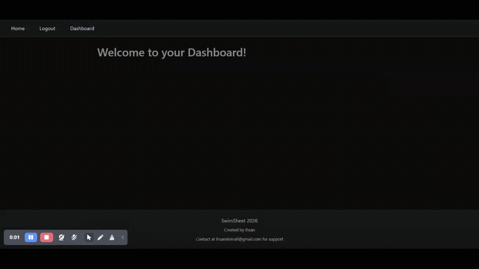
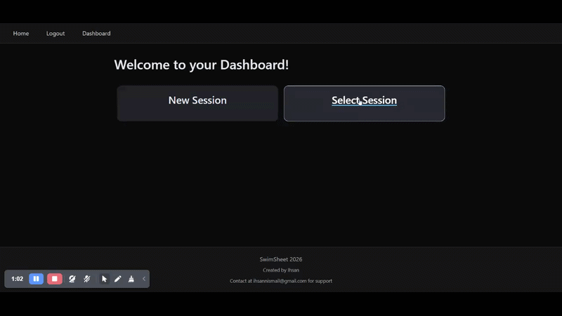
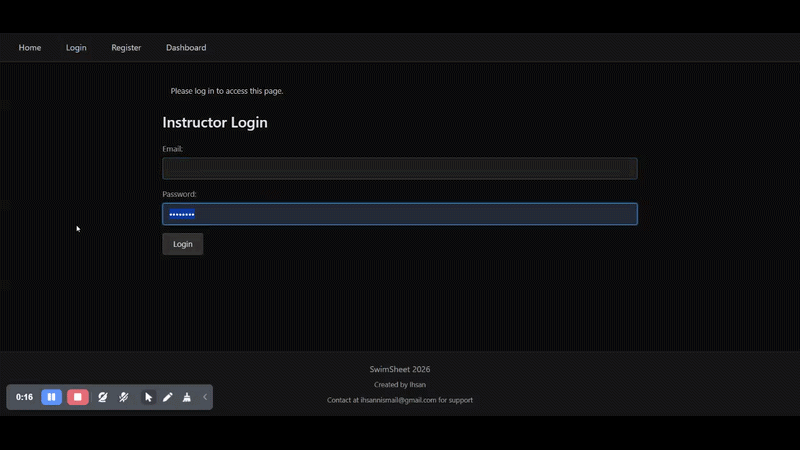

# SwimSheet

A full-stack web application that digitizes paper-based swim lesson tracking for Aquatics Instructors.

Available [here](https://swimsheet.onrender.com/)
*Note: This site is only accessible to approved aquatics employees.*

## Purpose

Swim instructors (me included) deal with a recurring problem: paper test sheets get wet, lost, or damaged at the pool deck. Keeping track of student progress across multiple classes becomes difficult to manage, and rewriting sheets after the session is complete is disruptive. SwimSheet solves this by giving instructors a centralized place to manage their classes online and print clean, pool-ready PDF test sheets on demand.

## Features

- **Session management** — Create and manage multiple swim sessions, each tied to a level, pool, time slot, and weekday schedule.

  

- **Digital worksheets** — Edit student names, record skill completion, and assign pass/incomplete results directly in the browser.

  

- **PDF generation** — Print test sheets as PDFs modelled after aquatics grading layouts, with student names and skill marks overlaid onto the official template using ReportLab.

- **Student tracking** — Add and remove students from a session; skill results persist across edits and are reflected on printed sheets.

- **Instructor authentication** — Account registration requires administrator approval via a database flag before access is granted, ensuring instructors can only view and edit their own classes.

  

- **Data isolation** — Each instructor's sessions and student records are scoped to their account.

## Tech Stack

| Layer          | Technology                    |
| -------------- | ----------------------------- |
| Backend        | Python, Flask                 |
| Database       | PostgreSQL (hosted on Render) |
| ORM            | SQLAlchemy                    |
| Authentication | Flask-Login                   |
| PDF generation | ReportLab, pypdf              |
| Templating     | Jinja2                        |
| Frontend       | HTML, CSS (vanilla)           |

## Database Schema

- **Instructor** — accounts with approval gating
- **Level** — swim levels (e.g. Preschool 1–4) with associated skills
- **Session** — a class tied to an instructor, level, pool, and schedule
- **Student** — up to 8 students per session, sorted by name
- **studentresults** — skill completion records per student

## Stay tuned for updates!

